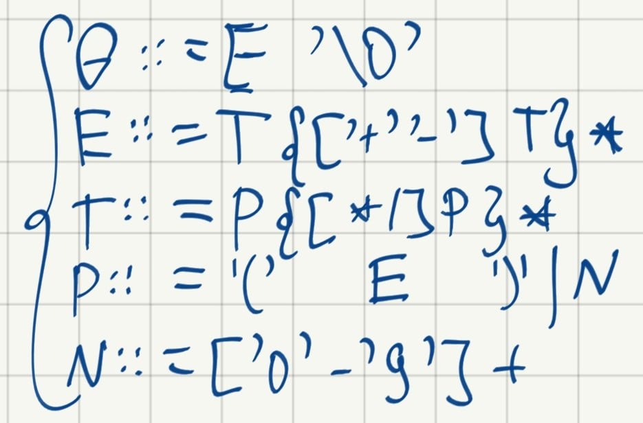

# Recursive descend
This is a realization of basic recursion algorithm. I use it for syntax analysis of equations, taking into account the priority of operations.

These are the rules of syntax analysis:

Of course, it's not for production. I've made it right after the lection as a training. In the future I'm going to use for creating of my personal programming language.